# Plugin Workshop Instructions

## Prerequisites
Before you begin, please make sure you have installed the latest version (3.20.0) of the [InVEST® Workbench](https://naturalcapitalalliance.stanford.edu/software/invest/invest-downloads-data#invest-workbench).

You may also want to have the following **optional** tools installed:
- [conda](https://docs.conda.io/en/latest)
- [git](https://git-scm.com/install/)
- your text editor of choice (VSCode, Sublime Text, Vim, etc.)

  Don't have a favorite text editor? No problem—most operating systems ship with a text editor you can use for this activity. Try `Notepad` or `Edit` on Windows, or `TextEdit` on macOS.

- [QGIS](https://qgis.org/)

Some familiarity with Python will be helpful, but is not required.

## Phase 1
1. First, you'll need a copy of the source code. Navigate to the [Birb Habitat plugin repo](https://github.com/natcap/invest-plugin-for-workshop) and press the `Code` button.

    <picture>
      <source media="(prefers-color-scheme: dark)" srcset="./images/clone_repo-dark.png">
      <source media="(prefers-color-scheme: light)" srcset="./images/clone_repo-light.png">
      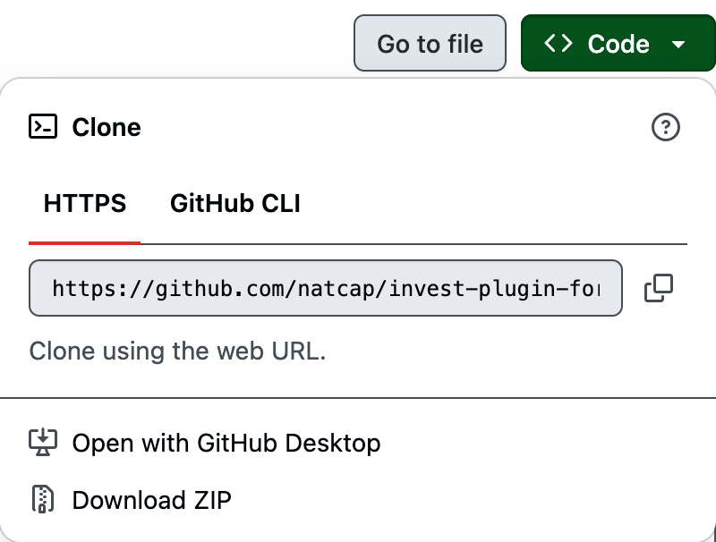
    </picture>

2. Choose one of the following:

    - If you have git installed, copy the git URL and `git clone` the repo using the command line.
    - If you don't have git (or would rather not use it right now), select `Download ZIP`. Once the `.zip` file has been downloaded, unzip it.

3. Open the cloned/downloaded repo folder in your text editor.

4. Before observing the plugin in action, we'll explore the code to learn about some key components of the InVEST Plugin API (package name, metadata, model spec, execute, validate) and optional components included with this plugin (sample data, reporter module).

5. Open the InVEST Workbench. Press the menu button in the upper-right corner of the window, then, from the list of options, select `Manage Plugins`.

    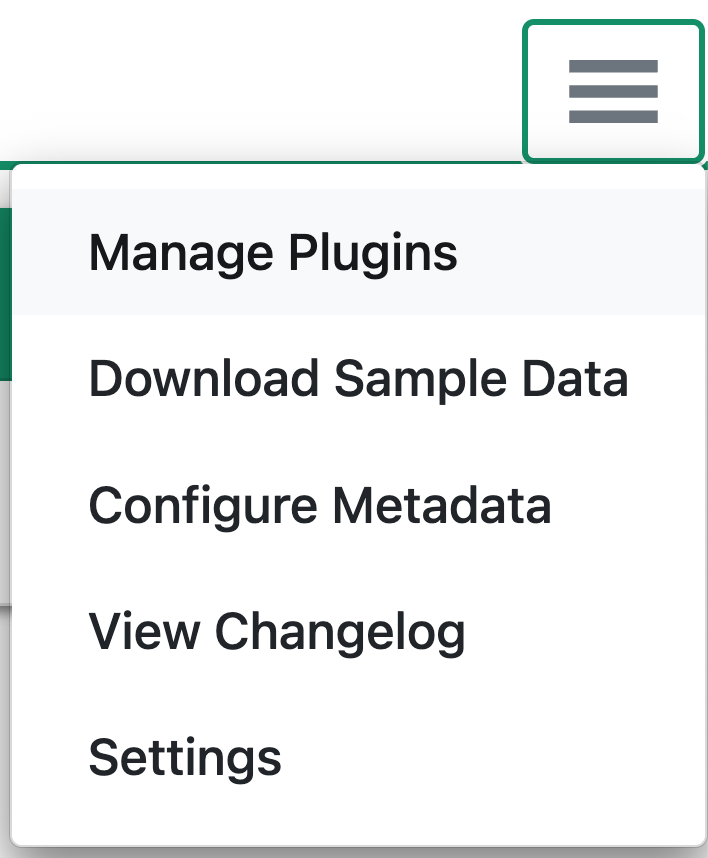

6. In the `Manage plugins` modal, find the `Install from` dropdown. Select `local path`, then in the `Local absolute path` field, enter the absolute path to the location where you cloned/downloaded this repo.

    On Windows, this will probably start with `C:/`; on macOS, it will probably start with `/Users/`. Regardless of your operating system, it should end with the name of the repo directory: `invest-plugin-for-workshop`.

    Read the disclaimer, check the checkbox, and then press the `Add` button.

    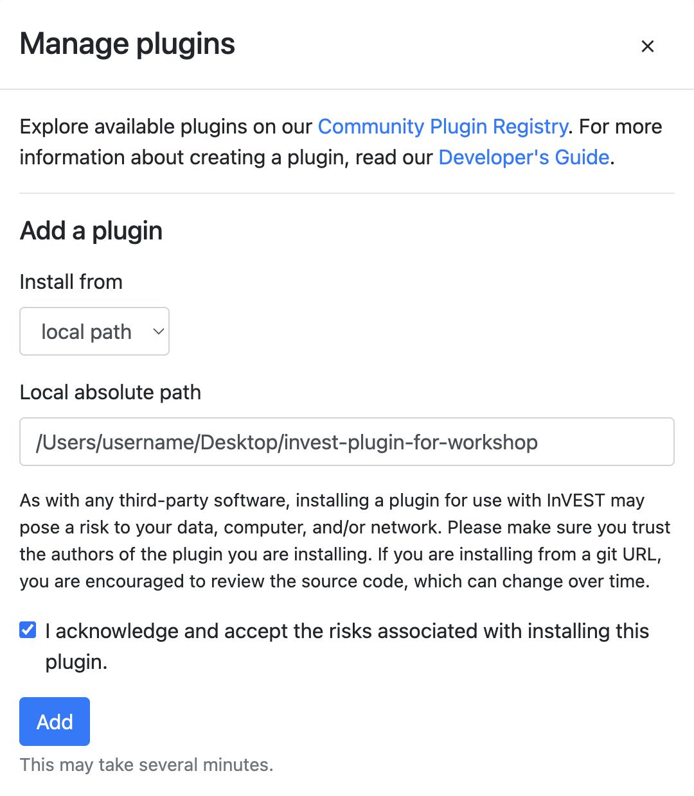

7. Wait for installation to complete. The spinner will stop spinning, and you'll see a `Successfully installed plugin` message.

    

8. Close the `Manage plugins` modal. You should now see the `Birb Habitat` model listed in the Workbench, between `Annual Water Yield` and `Carbon Storage and Sequestration`, and labeled with a `Plugin` badge.

    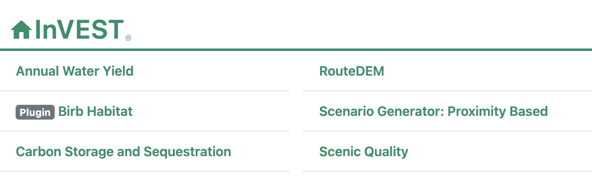

9. Select `Birb Habitat` to launch the plugin. Since this is the first time starting up this model, it may take a few minutes to load. Once it's done, you'll see a form with a few empty fields. These form fields are generated by the Workbench based on the inputs defined in the `MODEL_SPEC`.

    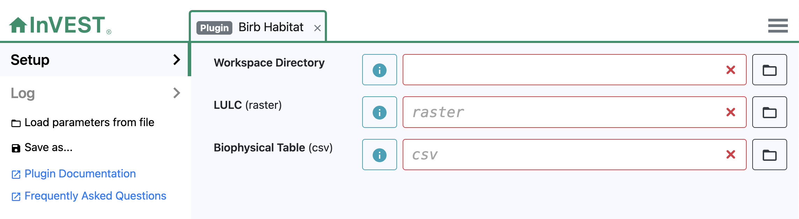

10. Next, we'll provide the model inputs by completing the form. For each of these inputs, you can type into the form field directly, or use the `browse` button (labeled with a file folder icon) to navigate to a directory or a file.

    - The `Workspace Directory` is entirely up to you. Choose any location on your computer where you would normally store files. If you want to create a new folder, select an existing location, then, in the form field, add a slash and the name of the folder you want to create. When the model runs, the folder will be created for you.

    - For the `LULC`, select `invest-plugin-for-workshop/sample_data/LULC.tif`.

    - For the `Biophysical Table`, select `invest-plugin-for-workshop/sample_data/biophysical_table.csv`.

    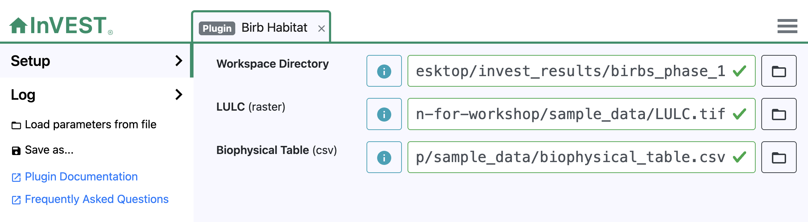

11. Press the `Run` button to run the model.

    

12. Once the model has finished running, it's time to check out the results! Press the `Open Workspace` button to navigate to the workspace directory. Open `birb_habitat_report.html` in any web browser to explore the report. A report is a visual summary of a model run that provides a convenient way to quickly validate results without having to load them into a GIS program.

    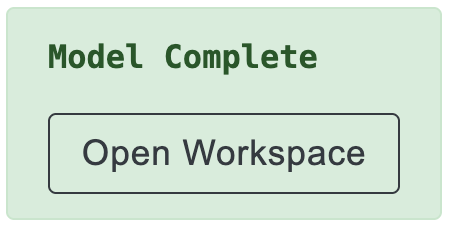

## Phase 2
1. [Optional, but recommended] Before we make changes to the plugin code, we'll do some configuration that will allow us to run the updated plugin in the Workbench without having to uninstall and reinstall the plugin each time we want to try out our updates.

    **If you don't have conda or mamba installed**, you can use the `Manage Plugins` feature in the Workbench to uninstall and reinstall the plugin whenever you want to test your updated plugin code. Since installation via the Workbench takes a little longer, it can be inconvenient during plugin development, which is why we recommend the following alternative.

    1. When we installed the plugin the first time, the Workbench created a dedicated virtual environment for it. We'll need the path to that environment, which is stored in a config file. First, we need to find that config file, whose location varies depending on your operating system.

        On Windows, you will find the config file at `%APPDATA%/invest-workbench/config.json`.

        On macOS, you will find the config file at `~/Library/Application Support/invest-workbench/config.json`. (Note: if you're using Finder to navigate to the file, you may need to press `⇧` + `⌘` +  `.` (`Shift-Command-Period`) to display files and folders that are usually hidden, such as `Library`.)

    2. Open the config file in your text editor. You'll see an entry called `plugins`, then nested inside that, an entry that starts with `birb_habitat`, and finally, nested inside that, an entry called `env`. The value stored here is the path to the plugin environment. Select the entire string, including the quotation marks, and copy it.

        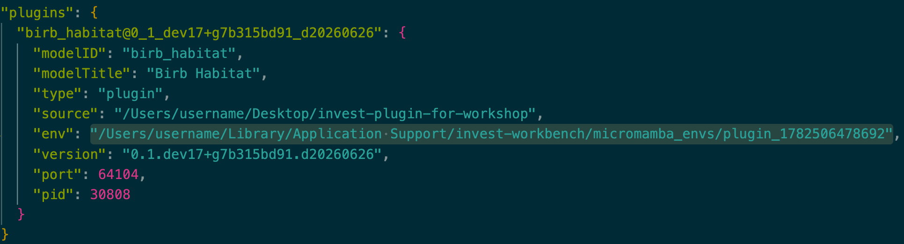

    3. From the command line (e.g., Git BASH on Windows, Terminal on macOS), activate the environment.

        For example:

        `conda activate "/Users/username/Library/Application Support/invest-workbench/micromamba_envs/plugin_1782506478692"`

    4. Next, we'll install the plugin into the activated environment. The `-e` flag stands for "editable." When we use an "editable install," the installed package will be automatically updated whenever we save changes to the source code—no need to uninstall and reinstall. From the command line, navigate into the repo directory (`invest-plugin-for-workshop`), then run `pip install -e .`. (Don't forget the `.`—it's part of the command!)

2. Return to your code editor and open the plugin module ([src/invest_plugin_for_workshop/plugin.py](./src/invest_plugin_for_workshop/plugin.py)).

3. Search `plugin.py` for `Uncomment for Version 2`, and uncomment each section labeled with `Uncomment for Version 2`. As you uncomment each section, notice what this new code is adding to the model.

    **Pro tip**: in many text editors, you can select multiple lines of text, then press `Ctrl` + `/` (on Windows) or `⌘` + `/` (`Command-Slash`, on macOS) to comment/uncomment all those lines at once.

    **Note**: when commenting/uncommenting code, it's not uncommon to mistakenly comment/uncomment too few or too many lines, landing your code in an awkward "in-between" state. If at any point you find your code has become broken and you're not sure why, you can check the files in the `backups` folder in this repo. For example, if you're working on Version 2, take a look at `backups/version_2.py` for a complete copy of the Version 2 code—no commenting/uncommenting needed. You can use the "backup" code as a reference to debug your own, or if you're stuck, you can delete everything from `plugin.py` and then copy and paste the entire contents of `backups/version_2.py` into `plugin.py`.

4. Save your changes to `plugin.py`.

5. Quit and reopen the Workbench, then relaunch the `Birb Habitat` model. You'll notice an additional form field, `Area of Interest`. Use the `browse` button to select `invest-plugin-for-workshop/sample_data/AOI.shp`.

    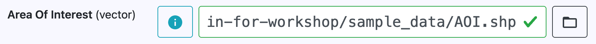

6. [Optional] You may want to choose a new workspace directory, if you'd like to be able to compare Phase 1 results side-by-side with Phase 2 results. For example, if you saved Phase 1 results to a folder called `birbs_phase_1`, you might choose to save Phase 2 results to a folder called `birbs_phase_2`.

    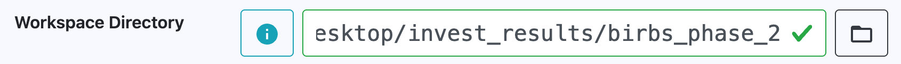

7. Press the `Run` button to run the updated plugin. Once it's complete, press the `Open Workspace` button, open `birb_habitat_report.html`, and observe the results. What do you see that is new or different compared to the previous version?

## Phase 3
1. Return to your code editor and open the plugin module ([src/invest_plugin_for_workshop/plugin.py](./src/invest_plugin_for_workshop/plugin.py)).

2. Search `plugin.py` for `Uncomment for Version 3`, and uncomment each section labeled with `Uncomment for Version 3`. As you uncomment each section, notice what this new code is adding to the model.

3. Save your changes to `plugin.py`.

4. Quit and reopen the Workbench, then relaunch the `Birb Habitat` model. You'll notice an additional form field, `Birb Population Density Table`. Use the `browse` button to select `invest-plugin-for-workshop/sample_data/birb_population_density_table.csv`.

    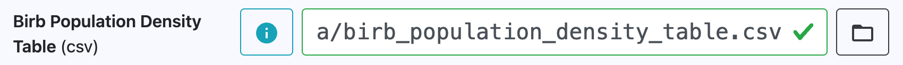

5. [Optional] You may want to choose a new workspace directory, if you'd like to be able to compare Phase 1 and/or Phase 2 results side-by-side with Phase 3 results. For example, if you saved Phase 1 results to a folder called `birbs_phase_1`, you might choose to save Phase 2 results to a folder called `birbs_phase_3`.

    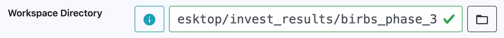

6. Press the `Run` button to run the updated plugin. Once it's complete, press the `Open Workspace` button, open `birb_habitat_report.html`, and observe the results. What do you see that is new or different compared to the previous version?

## Phase 4 (Challenge Exercise)
Want to push the Birb Habitat model—and your skills—even further? See if you can follow these steps to **add support for an alternate LULC scenario**.

### Tips
- Some experience with Python and familiarity with geospatial data processing will give you a head start here, but they are not strictly necessary.
- A sample Alternate LULC is provided in the sample data. Feel free to use it to test your solution.
- If you get stuck, try looking at the [source code of core InVEST models](https://github.com/natcap/invest/tree/main/src/natcap/invest) for examples! For instance, the [Carbon Storage and Sequestration model](https://github.com/natcap/invest/blob/main/src/natcap/invest/carbon/carbon.py) generates a difference map when an alternate LULC is provided.

### Steps
1. Update the model to take an additional input:
    - **Alternate LULC** (raster, units: None): Land use/land cover raster under an alternate scenario.
2. Update the model to produce the following additional outputs:
    - **birb_count_alt.tif** (raster, units: None): Map of total number of birbs per pixel under an alternate LULC scenario.
    - **aggregated_results_alt.gpkg** (vector): Birb density statistics under an alternate LULC scenario, aggregated over each polygon in the Area of Interest vector.
3. Update the model to produce the following additional outputs:
    - **birb_count_increase.tif** (raster, units: None): Map of total number of birbs per pixel gained under an alternate LULC scenario, when compared to the baseline LULC scenario. A positive number indicates an increase in that pixel's birb population; a negative number indicates a decrease.
    - **[GROUP]_count_increase.tif** (raster, units: None): Map of number of birbs (in a given birb group) per pixel gained under an alternate LULC scenario, when compared to the baseline LULC scenario. A positive number indicates an increase in that pixel's birb population; a negative number indicates a decrease. One raster is created for each birb group defined in the Birb Population Density Table.
4. Update the model reporter to include the new inputs and outputs:
    - **Alternate LULC**
    - **birb_count_alt.tif**
    - **aggregated_results_alt.gpkg**
    - **birb_count_increase.tif**
    - **[GROUP]_count_increase.tif**

    How and where you add these items to the report is up to you—if you were trying to make sense of the model's results at a glance, how would you want to see them organized? If you're still not sure, or you'd like to see some examples, check out the [Sample Carbon Report](https://storage.googleapis.com/releases.naturalcapitalproject.org/invest-reports/latest/carbon_report_willamette.html) (for baseline/alternate results, a difference map, and an alternate LULC) and/or any of the other [Sample InVEST Reports](http://releases.naturalcapitalproject.org/?prefix=invest-reports/latest/) (for various ways to present vector results).

## Further Exploration
Ready to get started on your own plugin? The [InVEST Plugins Developer's Guide](https://invest.readthedocs.io/en/latest/plugins.html) is here to help!

Want to learn how to make your plugin discoverable by InVEST users—or just want to explore other published plugins? Check out the [InVEST Plugin Registry](https://natcap.github.io/invest-plugin-registry/).

Thanks for taking the time to learn about InVEST Plugins. We look forward to growing the InVEST open-source ecosystem with you!
