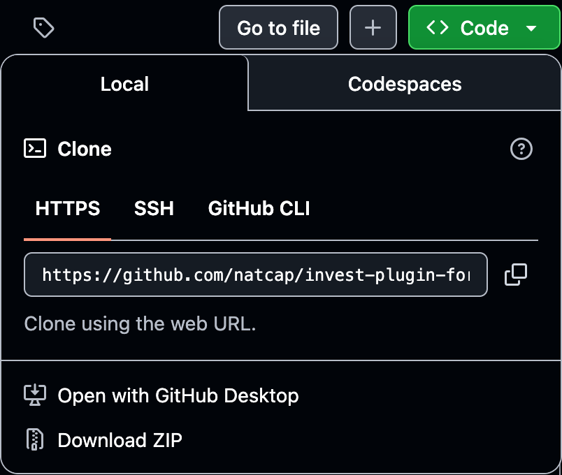

# Plugin Workshop Instructions

## Prerequisites
Before you begin, please make sure you have installed the latest version (3.20.0) of the [InVEST® Workbench](https://naturalcapitalalliance.stanford.edu/software/invest/invest-downloads-data#invest-workbench).

You may also want to have the following **optional** tools installed:
- [conda](https://docs.conda.io/en/latest)
- [git](https://git-scm.com/install/)
<!-- @TODO: should some sort of text editor be required? and/or should we specify basic text editors shipped with common operating systems? -->
- your text editor of choice (VSCode, Sublime Text, Vim, etc.)
- [QGIS](https://qgis.org/)

Some familiarity with Python will be helpful, but is not required.

## Phase 1
1. First, you'll need a copy of the source code. Navigate to the [Birb Habitat plugin repo](https://github.com/natcap/invest-plugin-for-workshop) and select the `Code` button.

<picture>
  <source media="(prefers-color-scheme: dark)" srcset="./images/clone_repo-dark.png">
  <source media="(prefers-color-scheme: light)" srcset="./images/clone_repo-light.png">
  
</picture>

2. Choose one of the following:

    - If you have git installed, copy the git URL and `git clone` the repo using the command line.
    - If you don't have git (or would rather not use it right now), select `Download ZIP`. Once the `.zip` file has been downloaded, unzip it.

3. Open the cloned/downloaded repo folder in your text editor.

<!-- @TODO: ¿add breakpoints where people should pause for wait for the rest of the group to catch up? -->
<!-- **Breakpoint: Let us know when you're here, and then we'll all move on to the next step together.** -->

4. Before observing the plugin in action, we'll explore the code to learn about some key components of the InVEST Plugin API (package name, metadata, model spec, execute, validate) and optional components included with this plugin (sample data, reporter module).
<!-- @TODO: add more detail here -->

<!-- @TODO: add more detail to these steps! -->
5. Install the plugin.

6. Launch the plugin.

7. Load the model inputs.

8. Run the plugin.

9. Observe the results.

## Phase 2
<!-- @TODO
1. Editable install -->

1. Return to your code editor and open the plugin module ([src/invest_plugin_for_workshop/plugin.py](./src/invest_plugin_for_workshop/plugin.py)).

2. Search `plugin.py` for `Uncomment for Version 2`, and uncomment each section labeled with `Uncomment for Version 2`. As you uncomment each section, notice what this new code is adding to the model.
<!-- @TODO: Detail each change here. -->

<!-- @TODO: add more detail here if needed (e.g., loading additional inputs) -->
3. Run the updated plugin and observe the results.

## Phase 3
1. Return to your code editor and open the plugin module ([src/invest_plugin_for_workshop/plugin.py](./src/invest_plugin_for_workshop/plugin.py)).

2. Search `plugin.py` for `Uncomment for Version 3`, and uncomment each section labeled with `Uncomment for Version 3`. As you uncomment each section, notice what this new code is adding to the model.
<!-- @TODO: Detail each change here. -->

<!-- @TODO: add more detail here if needed (e.g., loading additional inputs) -->
3. Run the updated plugin and observe the results.

## Phase 4 (Challenge Exercise)
Want to push the Birb Habitat model—and your skills—even further? See if you can follow these steps to **add support for an alternate scenario**.

### Tips
- Some experience with Python and familiarity with geospatial data processing will give you a head start here, but they are not strictly necessary.
- A sample Alternate LULC is provided in the sample data. Feel free to use it to test your solution.
- If you get stuck, try looking at the [source code of core InVEST models](https://github.com/natcap/invest/tree/main/src/natcap/invest) for examples! For instance, the [Carbon Storage and Sequestration model](https://github.com/natcap/invest/blob/main/src/natcap/invest/carbon/carbon.py) generates a difference map when an alternate LULC is provided.

### Steps
1. Update the model to take an additional input:
  - **Alternate LULC** (raster, units: None): Land use/land cover raster under an alternate scenario.
2. Update the model to produce the following additional outputs:
  - **birb_count_alt.tif** (raster, units: None): Map of total number of birbs per pixel under an alternate LULC scenario.
  - **aggregated_results_alt.gpkg** (vector): Birb density statistics under an alternate LULC scenario, aggregated over each polygon in the Area of Interest vector and broken down by birb group.
3. Update the model to produce one more additional output:
  - **birb_count_increase.tif** (raster, units: None): Map of total number of birbs per pixel gained under an alternate LULC scenario, when compared to the baseline LULC scenario. A positive number indicates an increase in that pixel's birb population; a negative number indicates a decrease.
4. Update the model reporter to include the new inputs and outputs:
  - **Alternate LULC**
  - **birb_count_alt.tif**
  - **aggregated_results_alt.gpkg**
  - **birb_count_increase.tif**

  How and where you add these items to the report is up to you—if you were trying to make sense of the model's results at a glance, how would you want to see them organized? If you're still not sure, or you'd like to see some examples, check out the [Sample Carbon Report](https://storage.googleapis.com/releases.naturalcapitalproject.org/invest-reports/latest/carbon_report_willamette.html) (for baseline/alternate results, a difference map, and an alternate LULC) and/or any of the other [Sample InVEST Reports](http://releases.naturalcapitalproject.org/?prefix=invest-reports/latest/) (for various ways to present vector results).

## Further Exploration
Ready to get started on your own plugin? The [InVEST Plugins Developer's Guide](https://invest.readthedocs.io/en/latest/plugins.html) is here to help!

Want to learn how to make your plugin discoverable by InVEST users—or just want to explore other published plugins? Check out the [InVEST Plugin Registry](https://natcap.github.io/invest-plugin-registry/).

Thanks for taking the time to learn about InVEST Plugins. We look forward to growing the InVEST Plugin open-source community with you!
